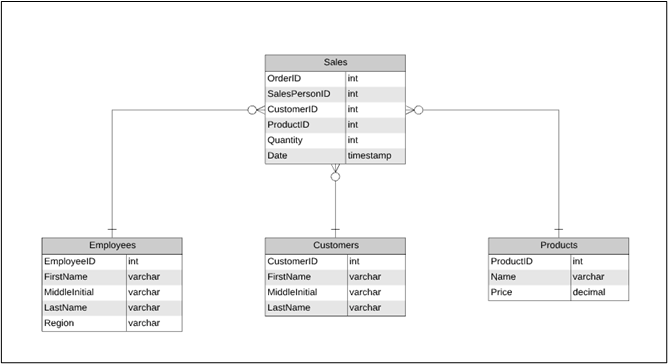

# Snowflake_POC
Exploring snowflake

Team Name: TBD (Team Big Data)

Private Slack Channel Name: project_1_tbd

Group Members: Tushar Gowda, Andrew LaFortune, Raj Vaibhav Gude, Shashank Magdi


## Environment Setup

To set up this project a total of 5 SQL scripts need to be run. **Run the scripts in the order of the table below**. 

To run any of the SQL scripts individually use the following command:
```
snowsql <connection_parameters> -f <path_to_file>
```

| Run Order  | File Name                         | Path                                           | Description
| ---------- | --------------------------------- | ---------------------------------------------- | ---------------------------------------
|      1     | create_db_schema_tables.sql       | set_up_scripts/create_db_schema_tables.sql     | Create the database, schemas, and tables.
|      2     | create_stages.sql                 | set_up_scripts/create_stages.sql               | Create stages sets the source we import data from. (Amazon S3)
|      3     | load_data.sql                     | set_up_scripts/load_data.sql                   | Load the data from stage to created tables.
|      4     | transfer_data_to_curated.sql      | set_up_scripts/transfer_data_to_curated.sql	  | Filter the data errors and loads data into the curated schema.
|      5     | views_for_curated.sql             | set_up_scripts/views_for_curated.sql 		     | Create views in the curated schema.

An alternative to running each SQL script individually is to use the utility script in the [set_up_scripts](set_up_scripts) folder called [set_up_environment.sh](set_up_scripts/set_up_environment.sh). This script quits as soon as an error is encountered. If the output is required to be suppressed, set the SUPRESS_OUTPUT variable to true. To run use the command:
```
set_up_scripts/set_up_environment.sh
```

## Environment Teardown

To undo all the changes that have been done in this project use the [tear_down.sql](tear_down_script/tear_down.sql). To run it use the following command:
```
snowsql <connection_parameters> -f tear_down_script/tear_down.sql
```
Alternatively, you can run the [shell script](tear_down_script/tear_down_script.sh) provided in the tear_down_script folder with:
```
tear_down_script/tear_down_script.sh
```

## Raw Data Quality Analysis
1. Sales
   - null check for all cols - PASS
   - check if quantity is less than 0 - PASS
   - check the range of sales. Was between 2018 and 2020 which seems to be sane values - PASS
   - check if orderid is unique - PASS
   - duplicate primary key - PASS

2. Products
   - check if price is less than 0 - PASS 
   - check if price is equal to 0 - FAIL (48 products) (Chad clarification: Do not filter this)
   - null check for all cols - PASS
   - check if all names are unique and flag if requried. - PASS
   - duplicate primary key - PASS

3. Employee
   - null check for firstname, lastname and region - PASS
   - duplicate primary key - PASS
   
4. Customers
   - null check for firstname, lastname and region - PASS
   - duplicate primary key - FAIL (1 duplicate - 17829)
 
5. Join check:
   - check if sales has any invalid foreign key - PASS

## Description of Curated Data


The curated data model contains the tables shown in the model above with foreign key relations from Sales to each of Employees, Customers, and Products.

3 new Views of the data model also exist:
1. CUSTOMER_MONTHLY_SALES_2019_VIEW
   - The total dollar amount spent by a customer in each month of the year 2019
   - Includes columns: Customer_LastName, Customer_FirstName, year, month, total_amount
2. TOP_TEN_CUSTOMERS_AMOUNT_VIEW
   - The total dollar amount spent by the ten highest spending customers across the entire range of sales data
   - Includes columns: Customer_ID, total_amount
3. PRODUCT_SALES_VIEW
   - A join of the Sales and Products tables. Each row represents one item in an order as the rows in Sales do. This view provides the additional information of the product's name, price per product, and the total amount spent on the product in this order.
   - Includes columns: OrderID, SalesPersonID, CustomerID, ProductID, Product_Name, Product_Price, Quantity, total_sales_amount, sales_day, sales_year, sales_month

## Snowflake Materialized Views and Clustering

## Appendix: Using Key Pair Authentication
To connect to your Snowflake account through SnowSQL using the key pair authentication method. For this, you will need a private key and a public key.
To use the key pair with SnowSQL it needs to be encrypted.
Generate the private key using the following command:
```
openssl genrsa 2048 | openssl pkcs8 -topk8 -inform PEM -out rsa_key.p8
```
It will ask you for an encryption password. Use a strong one and store it for future use.

Generate the public key corresponding to this private key using the following command
```
openssl rsa -in rsa_key.p8 -pubout -out rsa_key.pub
```

Copy the contents of the public key and execute the following command using your web console:
```
alter user <user_name> set rsa_public_key=‘<public key contents>’
```
Now you are ready to use key pair authentication.
You can enter snowsql using the following command:
```
snowsql -a <account_name> -u <user_name> --private-key-path <path_to_the_private_key_generated_above>
```
This will prompt you to enter a passphrase for which you need to enter the password that you saved earlier while generating your private key. To skip this part set your SNOWSQL_PRIVATE_KEY_PASSPHRASE environment variable to the password by using the following command (MacOS/Linux systems):
```
export SNOWSQL_PRIVATE_KEY_PASSPHRASE='<encryption_password>'
```

## Setting up a connection
To avoid typing in credentials every time you connect, you can set up saved connections in the config file. Adding the following text to the config file (which usually resides in ~/.snowsql/config) will create a connection named login:
```
[connections.login]
accountname = <snowflake_account_name>
username = <snowflake_user_name>

private_key_path = <path_to_private_key>
```
After this you can enter snowsql by using the following command
```
snowsql -c login
```
You can define multiple saved connections by adding another section with a header in square brackets followed by a list of parameters if you need to access multiple different accounts or databases. 
```
[connections.<connection_name>]
accountname = ...
```
See the [Snowflake documentation](https://docs.snowflake.com/en/user-guide/snowsql-start.html) for more details on connection syntax and parameters.
